Si se hace esto, se vuelve a hacer el merge de los RunType que hay en el  RunTypeToBeMerged_v01
cp /eos/home-v/valcayne/nTOFDataProcessing/2026_Sm/2DHistos/v02GainCorrected/del.txt /eos/home-v/valcayne/nTOFDataProcessing/2026_Sm/2DHistos/v02GainCorrected/del1.txt

## [21/04/2026,Adrian] Baseline oscillation in Det 1 📉
Baseline oscillation increased in Det C6D6 1, starting at run 124724. Seems to be related with the connection of LaBr3 detectors to the DAQ of EAR1 (Pb measurement in NEL). 

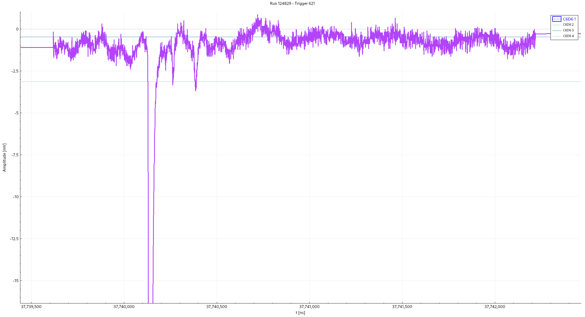

Some observations: 
- C6D6 1 already had some oscillations on the baseline but now it is clearly worse (stronger).
- SignalAnalyzer inspected: the oscillations create fake signals fitted by the routine with maximum amplitudes about 150 ADC channels (~65 keV): 

    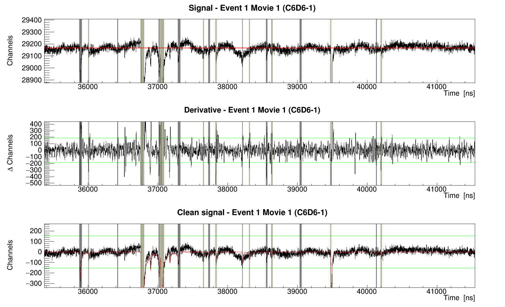

- The second rebound seem to be affected by this change, and sometimes the rebound is detected as a fake signal using the previous average pulse shapes (confirmed by Victor by extracting a new average pulse shape). 
- The other three detectors seem to be unaffected.
- The increased oscillation does not seem to get worse since it began in run 124724. 
- Inspecting the Edep, comparing before (Cs_8, Cs_11) and after (Cs_12) the connection of LaBr3 to DAQ, there is no visible effect on the shape of the Cs-137 spectrum: 

    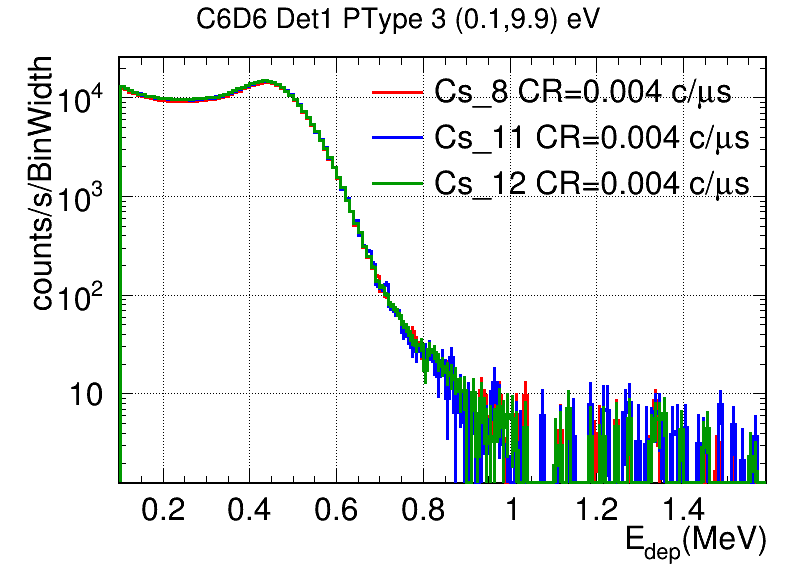
    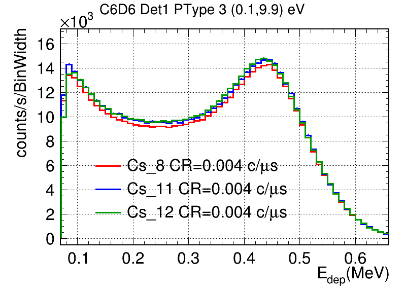 

- **Conclusion**: the increased oscillations of baseline seem small enough to have a significant impact on the data analysis, and should not imply any problem. 
- **Action**: we will continue like this since the oscillation appears to be stable during the runs. 

## [21/04/2026,Adrian] Cs_9 issue! 🔍
- There is a bump in the Edep spectrum of Cs_9 measurement at around 1.7 MeV, visible in all detectors. 
- It seems that an Y-88 source was also in the experimental area and affected the measurement. 
- **Action**: I remove this run for the `Cs` run type in the RunList. 

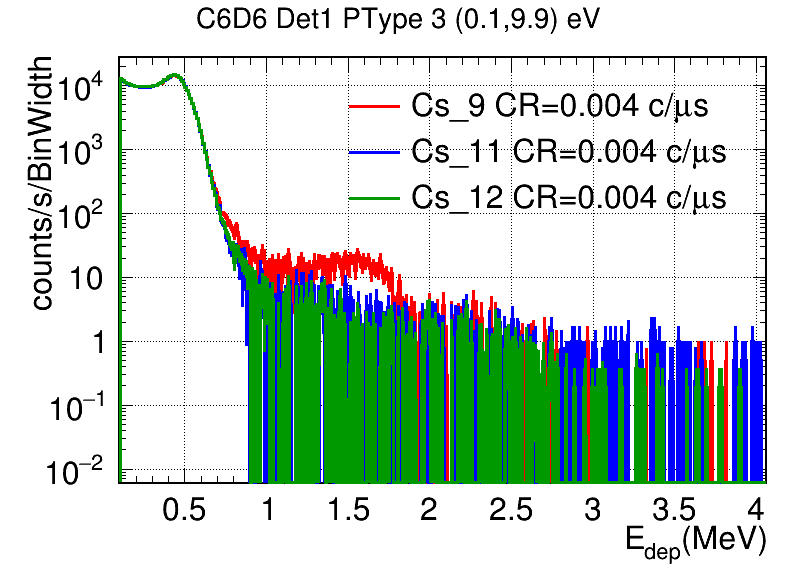

## [02/05/2026,Adrian] High-Frequency noise in C6D6 #2 and #3 near g-flash
Jarek noticed during his shift that detectors C6D6 2 and 3 had strange behavior at many pulses in the form of a high-frequency noise during a few microseconds after g-flash.

It was already present in Sm runs: 

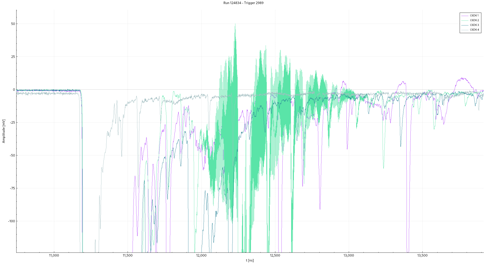
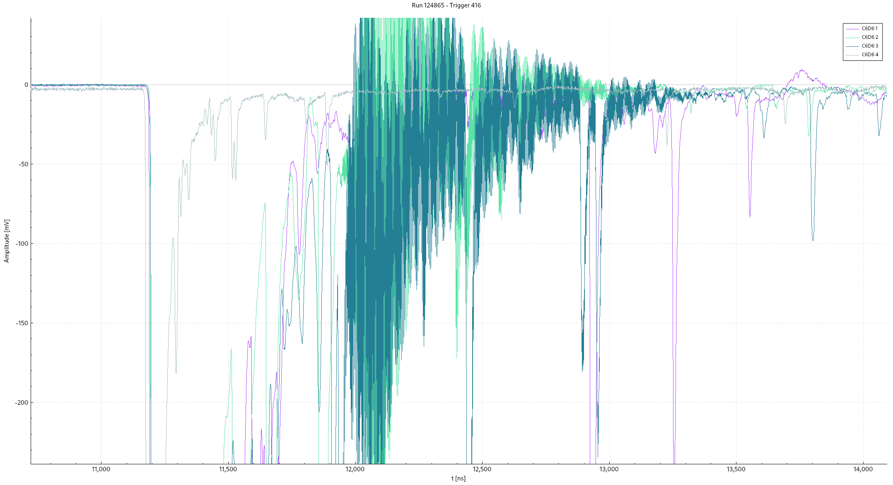

General remarks: 
- I checked the behavior and confirmed it is mainly happenning in these two detectors and close to g-flash. In neutron energies this noise ends well above 10 MeV.
- I compared with previous runs from Sm measurements and the HF noise was already there, but it is true that has **become more frequent** with pulses during the Mo92 measurement.
- It only affects some of the dedicated pulses. No HF noise was observed with parasitic pulses ➡️ clearly related with strong g-flash. 

> **Conclusion**: to be monitored for next runs. As long as it does not extend below 10 MeV, this should not be a problem for us. 

## [12/05/2026,Adrian] Worse baseline oscillation of Det 1
During 11th may there was an intervention in the EAR1 DAQ, some (unused) cards and cables were replaced, and the LaBr3 cables were touched, although they were left in the same position as they were before the intervention. 

- ❗ However, after calibrations, in the middle of the first beam run (**125105**) the file sizes increased from 90 Mb to 200 Mb, and this was caused by an increased baseline oscillation of C6D6 1, triggering the zero suppression threshold. 
- In the next runs with beam, this seems to be somehow alleviated, but still the oscillation is larger than it was before the DAQ intervention. See picture:

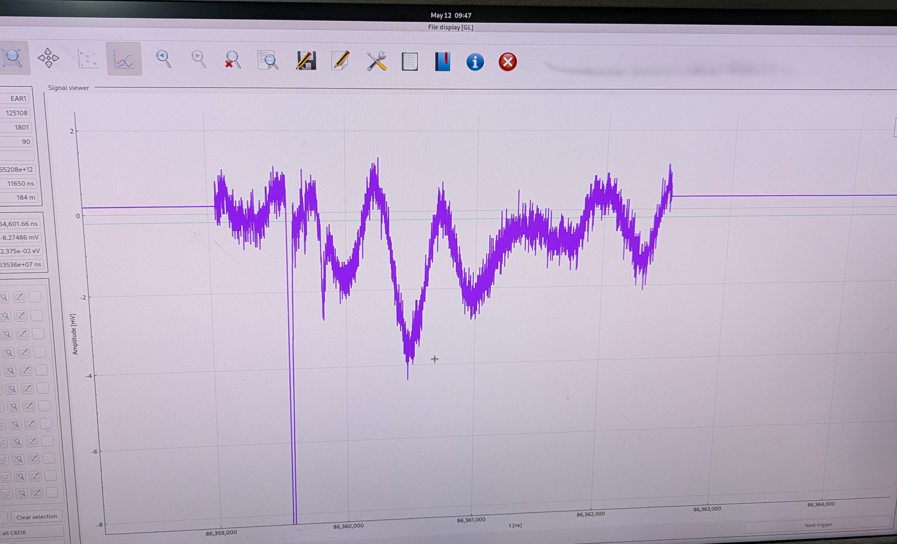

- ✅ The other 3 detectors are okay.
- 🛠️ **Action**: During next intervention (change from 149Sm to Au 20 mm), I did a run with Cs-137. Afterwards, I checked Det 1 cable connection in the DAQ: I unplagged it, I blew it, and plugged it again. Now, in the second run with Cs-137 (125111) the noise is drastically removed in Det 1 (at least as it was at the beginning of the EAR1 2026 capture campaign). See picture comparing previous (left) and new Cs run: 

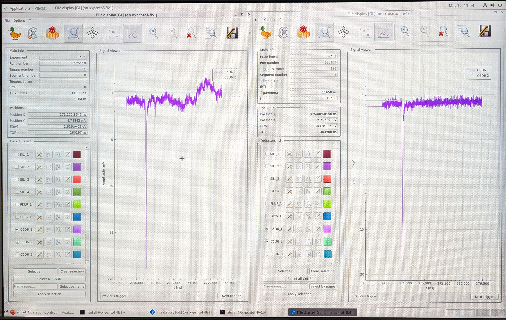

- 👍🏻 Noise reduced even with beam. Pictures from the Au 20 mm run: 

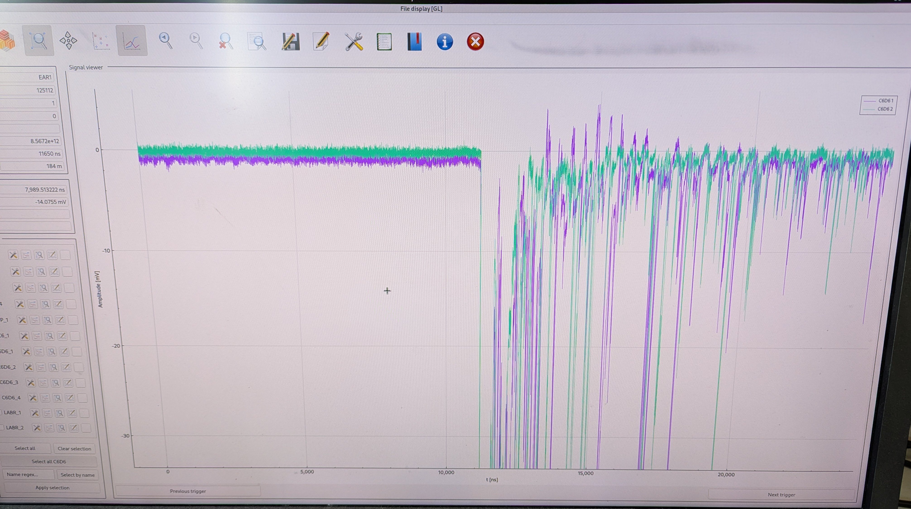
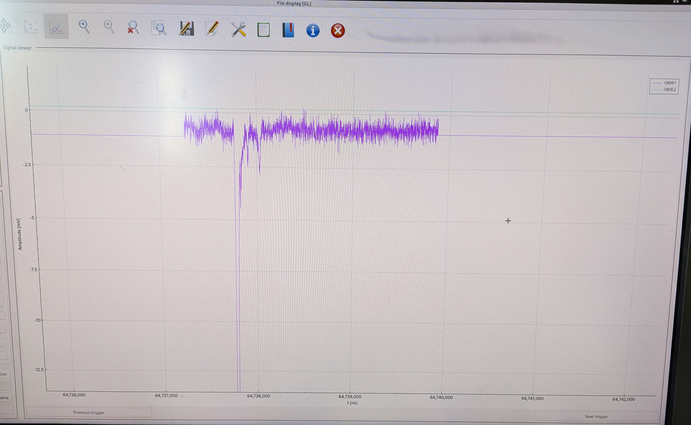

